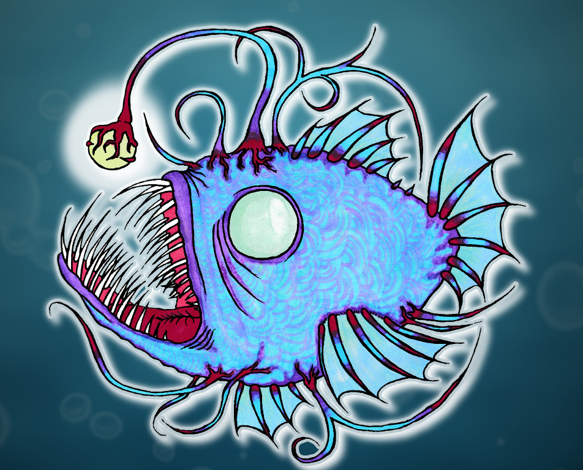

# ANGLERFISH

Anglerfish is a pure functional library about odds and ends in the big data world.
If you have ever worked with Avro GenericRecords and wanted to set your computer on fire you might want to have a look at this lib.

# BEWARE
This lib is in its very early stages and there are things that are not implemented yet, untested and/or outright broken and all other kinds of horribe. PRs, Issues and Tips welcome <3

## Note
Please be patient quite often I will write code for this library while under contract and I have to make sure everything is cleared before moving it to this repo. So it might be a while between me having done a feature and it appearing here. Either due to paper work that has to be taken care of or parts having to be generalized

## Whats in it right now?

1. Avro schema and Avro Json decoding using matryoshka (so rather than dealing with Generic Record you'll have a proper ADT)
3. InterOp algebras to (un)fold org.apache Schema and underlying generic representaions of data (the actual format depends on the schema you use for decoding. e.g. GenericData.Record for records. Int for the schema "int") 
2. JsonF pattern functor using circe underneath (this kinda drives 1.)

## What's coming up next (features)
1. Recursive schema support (as soon as I figure out how to do that)
2. Default value support for fields in Avro records as AvroValue ADT
3. Support for different datum parsing mode. Strict so additional fields are not allowed on records. Inclusive so they are and maybe more
4. Final Tagless Interfaces for :
   * HDP / Confluent Schema Registry
   * Kafka
   * Caching wrapping 
   * Hadoop FS Ops
   
## Things that I need to fix ASAP (bugs etc)
1. string matching for fieldnames, type names etc.
2. compiler flags for warnings
3. generalize interop algebras to any monaderror (it's either right now)
4. Refactor and clean up the code. remove old code snippets and comments
5. Error Types
   
   
## Things that have to be done sooner or later
1. Crossbuilding 
   * 2.11.8 for Spark users
   * 2.12.x for people who aren't trapped
   * 2.13 as soon as that's a thing
2. Set up multi project build in sbt
3. Set up publishing (too early now)
4. Test coverage
5. Tut examples
6. eventually a microsite

## Long Term and ideas
1. Binary Encoding/Decoding of Avro data
2. Writing and Reading Avro Files
3. Richer API around JsonF
4. FS2 integration for Avro

